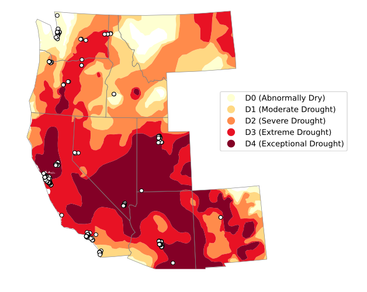

# datacenters-and-drought

Map visualization of datacenters and drought occurrences in Western USA on June 22, 2021.

_Research by [Gauthier Roussilhe](https://gauthierroussilhe.com/). Technical cartography work by B. Keller and F. Manca._



## Installation

**Pre-requisites**:

* Python 3.8+
* C libraries (install via `apt`, `brew`, or another package manager for your system):
  * `geos`
  * `proj`
  * [`spatialindex`](https://libspatialindex.org/en/latest/)

Then run the install script:

```bash
scripts/install
```

## Quickstart

First, initialize datasets:

```bash
scripts/initdata
```

Generate the map (output in `out/`):

```bash
scripts/main
```

## Troubleshooting

### (macOS) `geos_c.h` / `proj_api.h` file not found

Problem: during `scripts/install`, one of these errors shows up:

```console
  lib/cartopy/trace.cpp:633:10: fatal error: 'geos_c.h' file not found
  #include "geos_c.h"
           ^~~~~~~~~~
  1 error generated.
  error: command '/usr/bin/clang' failed with exit code 1
```

```console
  lib/cartopy/trace.cpp:634:10: fatal error: 'proj_api.h' file not found
  #include "proj_api.h"
           ^~~~~~~~~~~~
  1 error generated.
  error: command '/usr/bin/clang' failed with exit code 1
```

Solution:

* `brew install geos`
* `brew install proj@7`.
* Add `export CPPFLAGS="$CPPFLAGS -I/usr/local/opt/proj/include"` to your bash profile (e.g. to `~/.zshrc`).
* Restart your shell.
* Ensure `pkg-config --cflags proj` shows something like `-I/usr/local/Cellar/proj@7/7.2.1/include`.
* Retry.

## Credits

* Datacenter data from [datacenters.com](https://datacenters.com).
* Drought data from [Drought Monitor](https://droughtmonitor.unl.edu/CurrentMap/StateDroughtMonitor.aspx?West).

## License

MIT
